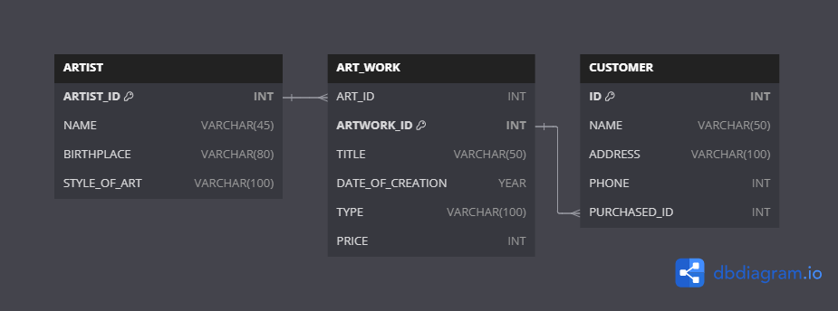
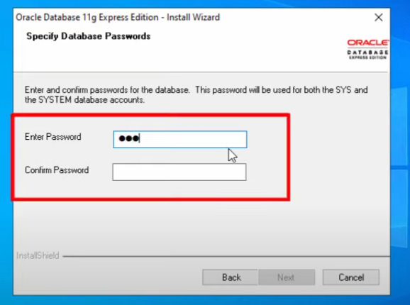

**Art Work Management**



## Download Oracle database
> Download the  ([Oracle Database 11g Express Edition](https://www.oracle.com/database/technologies/xe-prior-release-downloads.html)) and install the software.
> Remember the password during the installation because this password is used for connecting the database account.




> Open Run SQL Command line and type the following command and use to password set in the installation process. You may not see the password but don't worry it is getting typed.


```
connect system;
connect / as sysdba
```

>To change the password : 

```
alter user system identified by [password]
```

>To drop the table:

```
DROP TABLE [TABLE_NAME]
```

>CREATE ARTIST TABLE:

```
CREATE TABLE ARTIST(
ARTIST_ID INT PRIMARY KEY,
NAME VARCHAR(45),
BIRTHPLACE VARCHAR(80),
STYLE_OF_ART VARCHAR(100)
);
```

>CREATE ART_WORK TABLE :

```
CREATE TABLE ART_WORK(
ART_ID INT,
ARTWORK_ID INT PRIMARY KEY,
TITLE VARCHAR(50),
DATE_OF_CREATION DATE,
TYPE VARCHAR(100),
PRICE INT,
FOREIGN KEY (ART_ID) REFERENCES ARTIST(ARTIST_ID)
);
```

>CREATE CUSTOMER TABLE:

```
CREATE TABLE CUSTOMER(
ID INT PRIMARY KEY,
NAME VARCHAR(50),
ADDRESS VARCHAR(100),
PHONE INT,
PURCHASED_ID INT,
FOREIGN KEY (PURCHASED_ID) REFERENCES ART_WORK(ARTWORK_ID)
);
```

>GETTING THE INFORMATION OF THE ARTIST WHOSE ART-WORK IS PURCHASED BY John Doe:

```
SELECT * FROM ARTIST WHERE ARTIST_ID = (SELECT ART_ID FROM ART_WORK WHERE ARTWORK_ID = (SELECT ID FROM CUSTOMER WHERE NAME = 'John Doe'));
```
.png)

>GETTING THE INFO OF THE ART WORK BOUGHT BY THE CUSTOMER WITH ID = 1:

```
SELECT * FROM ART_WORK WHERE ARTWORK_ID = (SELECT PURCHASED_ID FROM CUSTOMER WHERE ID = 1);
```
.png)


>UPDATING DATA IN ARTIST TABLE USING NESTED SUBQUERY:

```
UPDATE ARTIST SET NAME = 'SOHEL' WHERE ARTIST_ID = (SELECT ART_ID FROM ART_WORK WHERE ARTWORK_ID = (SELECT PURCHASED_ID FROM CUSTOMER WHERE ID = 1));
UPDATE ARTIST SET NAME = 'Leonardo da Vinci' WHERE ARTIST_ID = 1;
```


>DELETING DATA FROM THE ARTIST TABLE:
```
INSERT INTO ARTIST (ARTIST_ID, NAME, BIRTHPLACE, STYLE_OF_ART) VALUES (10, 'Leonardo da Vinci', 'KUET', 'Renaissance');
DELETE FROM ARTIST WHERE ARTIST_ID = 10;
```

>THIS COMMAND WILL JOIN THE ROWS OF THE THREE TABLES BASED ON COMMON VALUES. ARTIST TABLE'S ARTIST ID IS REFERENCED BY THE ART_ID FROM THE ART_WORK TABLE. ARTWORK_ID COLUMN IS REFERENCED BY THE PURCHASED_ID FROM THE CUSTOMER TABLE. THIS COMMAND WILL PERFROM THE JOIN OPERATION ON THIS COMMON COLUMNS:

```
SELECT * FROM ARTIST JOIN ART_WORK ON ARTIST.ARTIST_ID = ART_WORK.ART_ID JOIN CUSTOMER ON ART_WORK.ARTWORK_ID = CUSTOMER.PURCHASED_ID;
```


>PROCEDURE TO ADD DATA IN THE ARTIST TABLE:

```
CREATE OR REPLACE PROCEDURE INSERT_ARTIST(
    ID IN INT,
    NAME IN VARCHAR2,
    BIRTHPLACE IN VARCHAR2,
    STYLE_OF_ART IN VARCHAR2
) AS
BEGIN
    INSERT INTO ARTIST (ARTIST_ID, NAME, BIRTHPLACE, STYLE_OF_ART)
    VALUES (ID, NAME, BIRTHPLACE, STYLE_OF_ART);
    COMMIT;
    DBMS_OUTPUT.PUT_LINE('Artist record inserted successfully.');
END;
/

```
>COMPILE THE PROCEDURE AND SIMPLY CALL IT BY ANY OF THE FOLLOWING COMMANDS:
```
CALL INSERT_ARTIST(1112 , 'TAHER' , 'DHAMRAI' , 'DEMO');
EXECUTE INSERT_ARTIST(1112 , 'TAHER' , 'DHAMRAI' , 'DEMO');
```
>PROCEDURE TO DELETE ARTIST RECORD BY ID:

```
CREATE OR REPLACE PROCEDURE DELETE_ARTIST(D_ID IN INT)
AS
MSG CHAR(300);
BEGIN

MSG := 'ARTIST RECORD SUCCESSFULLY DELETED';
DELETE FROM ARTIST WHERE ARTIST_ID = D_ID;
COMMIT;
DBMS_OUTPUT.PUT_LINE(MSG);
EXCEPTION
    WHEN OTHERS THEN
        ROLLBACK;
        DBMS_OUTPUT.PUT_LINE('ERROR');
END;
/
```

>IF WE WANT TO DELETE A RECORD FROM THE ART_WORK TABLE BY THE COMMAND:

```
DELETE FROM ART_WORK WHERE ART_ID = 1;
```

>SHOW THE DETAILS OF ARTISTS WHO HAVE SOLD AT LEAST ONE PAINTING USING CURSOR AND PROCEDURE:


```
CREATE OR REPLACE PROCEDURE RETRIEVE_RICH_ARTISTS IS
  CURSOR ARTIST_CURSOR IS SELECT * FROM ARTIST WHERE ARTIST.ARTIST_ID IN (SELECT ART_ID FROM ART_WORK WHERE ARTWORK_ID IN (SELECT CUSTOMER.PURCHASED_ID FROM CUSTOMER));
  ARTIST_ROW ARTIST%ROWTYPE;
BEGIN
  OPEN ARTIST_CURSOR;
  FETCH ARTIST_CURSOR INTO ARTIST_ROW;
  WHILE ARTIST_CURSOR%FOUND
  LOOP
    DBMS_OUTPUT.PUT_LINE('Artist ID: ' || ARTIST_ROW.ARTIST_ID || ', Name: ' || ARTIST_ROW.NAME);
    DBMS_OUTPUT.PUT_LINE('Birthplace: ' || ARTIST_ROW.BIRTHPLACE || ', Style of Art: ' || ARTIST_ROW.STYLE_OF_ART);
    DBMS_OUTPUT.PUT_LINE('----------------------------------------');
    FETCH ARTIST_CURSOR INTO ARTIST_ROW;
  END LOOP;
  CLOSE ARTIST_CURSOR;
END;
/
```

[FULL DATA](/Assets/PROCEDURE%20USING%20CURSOR(1).png)
[AFTER PROC CALL](/Assets/PROCEDURE%20USING%20CURSOR.png)


>ADD COLUMN :

```
ALTER TABLE ARTIST ADD ARTIST_ID INT PRIMARY KEY;
```

